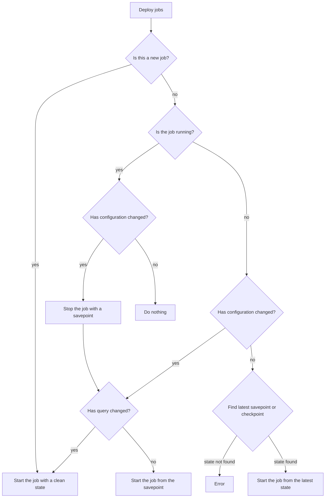

# Table of contents

- [flink-sql-runner](#flink-sql-runner)
    * [SQL job definition](#sql-job-definition)
        + [DataStream API](#datastream-api)
        + [Job output](#job-output)
            - [Job output example](#job-output-example)
    * [Deployment](#deployment)
        + [Infrastructure](#infrastructure)
            - [Session Mode](#session-mode)
        + [Prerequisites](#prerequisites)
        + [Running deployment scripts](#running-deployment-scripts)
        + [Procedure](#procedure)
        + [Job manifest](#job-manifest)
        + [S3 structure](#s3-structure)
        + [Query update](#query-update)
        + [Deployment scripts internals](#deployment-scripts-internals)
    * [Troubleshooting](#troubleshooting)
    * [Known issues](#known-issues)

---

# flink-sql-runner

_flink-sql-runner_ is a framework for scheduling streaming SQL queries on
[Apache Hadoop YARN](https://hadoop.apache.org/docs/stable/hadoop-yarn/hadoop-yarn-site/YARN.html) and on a standalone
Flink cluster. It simplifies defining and executing
[Flink SQL](https://nightlies.apache.org/flink/flink-docs-master/docs/dev/table/sql/overview/) jobs.
The user has only to declare job's manifest YAML file which contains the query to be executed and basic metadata.
Jobs lifecycle is managed by the framework.

The module has the following structure:

- `/flink_sql_runner/` - contains deployment scripts.
- `/flink_sql_runner/runner/` - contains Flink job runners.

Future improvements:

- Improve schema management. Avoid using static files if possible.
- Flink session cluster management should be improved and be the part of this module.

---

## SQL job definition

Each job should be defined in a separate YAML manifest file. The manifest has the following structure:

```yaml
---
name: query-unique-name
description: "Some description."
target-table: "`kafka`.`some-kafka-table-name`"
sql: >-
  SELECT
      `column_a`,
      `column_b`,
      `column_c`,
      `record_time`
  FROM
      `kafka`.`some-kafka-input-table`
  WHERE
      `column_d` = 'SOME_VALUE'
flinkProperties: { }
```

- `name`: The unique name of the query. This value is used to identify the job in monitoring, in internal state storage
  etc.
- `description`: Query description.
- `target-table`: Flink SQL table where the query results are put into. See [Job output](#job-output).
- `sql`: Flink SQL query that will be run by flink-sql-runner.
- `flinkProperties`: Flink properties specific for the query. Default properties are defined in `job-template.yaml`
  file. The defaults can be overwritten if needed.
  See [Flink Configuration](https://nightlies.apache.org/flink/flink-docs-master/docs/deployment/config/).

### DataStream API

Some use cases cannot be implemented using pure SQL approach. One can define `code` instead of `sql` as shown in the
example below:

```yaml
---
name: query-unique-name
description: "Some description."
target-table: "`kafka`.`some-kafka-table-name`"
code: >
  from pyflink.common.typeinfo import Types

  execution_output = stream_env.from_collection(
    collection=[(1, 'aaa'), (2, 'bb'), (3, 'cccc')],
    type_info=Types.ROW([Types.INT(), Types.STRING()])
  )
flinkProperties: { }
```

### Job output

Each job manifest contains `target-table` field, which is the name of the output Flink SQL table. Currently, the output
table definition has to be created manually.

It is worth mentioning that the framework adds basic metadata to the query outputs:

- `__create_timestamp` - datetime when the event was created.
- `__query_name` - query unique name taken from the job manifest.
- `__query_description` - query description taken from the job manifest.
- `__query_id` - query auto-generated UUID.
- `__query_version` - query version. See [Query update](#query-update).
- `__query_create_timestamp` - datetime when the query was scheduled.

#### Job output example

Let's consider the following example.

For query:

```sql
SELECT
    `column_a`,
    `column_b`,
    `column_c`,
    `record_time`
FROM
    `kafka`.`some-kafka-input-table`
WHERE
    `column_d` = 'SOME_VALUE'
```

the output table may have the following definition:

```sql
create table `kafka`.`some-flink-table-name` (
    `column_a` STRING,
    `column_b` INT,
    `column_c` STRING,
    `record_time` TIMESTAMP(3),
    `__create_timestamp` TIMESTAMP(3),
    `__query_name` STRING,
    `__query_description` STRING,
    `__query_id` STRING,
    `__query_version` INT,
    `__query_create_timestamp` TIMESTAMP(3)
) with (
    'connector' = 'kafka',
    'format' = 'json',
    'topic' = 'some-topic-name',
    'sink.delivery-guarantee' = 'at-least-once',
    'properties.bootstrap.servers' = 'example.com:9092'
)
;
```

---

## Deployment

### Infrastructure

Currently, the framework supports only deployment on a standalone Flink Session Cluster or a Flink Session Cluster
running on YARN.

#### Session Mode

There are two deployment modes in Flink to
consider: [Application Mode](https://nightlies.apache.org/flink/flink-docs-master/docs/deployment/overview/#application-mode)
and [Session Mode](https://nightlies.apache.org/flink/flink-docs-master/docs/deployment/overview/#session-mode)
(Per-Job Mode is deprecated).

- `Application Mode` - a dedicated Flink cluster is created for each Flink application.
- `Session Mode` - multiple Flink jobs shares the same Flink cluster.

Essentially, Application Mode provides higher resource isolation (separate cluster per job, that is, dedicated
JobManager, or two if HA is enabled) in comparison to Session Mode, but more resources are utilized. If there are tens
or hundreds of small jobs running, having a Session Cluster running all the jobs should save a lot of resources.

_Decision_: Flink jobs are deployed on a shared Flink Session Cluster.

### Prerequisites

- Session cluster is up and running.
- All necessary Flink dependencies are available on the classpath on the EMR master node.
- Python virtualenv with all necessary python dependencies is created on each EMR node.
  ```bash
  python3 -m pip install \
      -r flink-sql-runner/deployment-scripts/jobs-deployment/requirements.txt \
      -r flink-sql-runner/python/requirements.txt
  ```
- An S3 bucket for storing YAML manifests file is created. See [Job manifest](#job-manifest) section.

### Running deployment scripts

Sample command to trigger deployment of all queries on YARN:

```bash
python3 flink_sql_runner/deploy.py \
    --path /some/path/to/sql/queries/ \
    --template-file flink-sql-runner/deployment-scripts/job-template.yaml \
    --pyflink-runner-dir flink_sql_runner/runner/ \
    --pyexec-path /home/hadoop/flink-sql-runner/venv/bin/python3 \
    --external-job-config-bucket some-s3-bucket \
    --external-job-config-prefix flink-sql-runner/manifests/ \
    --table-definition-path /some/path/to/sql/schemas/kafka-input-tables.sql \
                            /some/path/to/sql/schemas/kafka-output-tables.sql \
    --deployment-target yarn
```

Sample command to trigger deployment of a single query:

```bash
python3 flink_sql_runner/deploy_job.py \
    --job-config-path some/path/some-query-name.yaml \
    --pyflink-runner-dir flink_sql_runner/runner/ \
    --pyexec-path /home/hadoop/flink-sql-runner/venv/bin/python3 \
    --external-job-config-bucket some-s3-bucket \
    --external-job-config-prefix flink-sql-runner/manifests/ \
    --table-definition-path /some/path/to/sql/schemas/kafka-input-tables.sql \
                            /some/path/to/sql/schemas/kafka-output-tables.sql \
    --deployment-target yarn
```

If your deployment target is a standalone cluster, please specify `--deployment-target remote`
and `--jobmanager-address <host>:<port`.

Please note that `job-config-path` points to a file which is the final manifest of the job, that is, already contains
query definition merged with the template file containing defaults.

### Procedure

`flink-sql-runner/deployment-scripts/jobs-deployment/deploy.py` script deploys all available jobs
sequentially. The procedure applied for each query is shown in the diagram below.



### Job manifest

To determine if the job is new or not, if the configuration or query has changed, we need to keep the job manifest in a
persistent store (S3). When deployment process starts, the framework compares the new and the old configuration and
executes deployment steps accordingly. After each successful job deployment, the manifest is updated and uploaded into
S3. The manifest has the following structure:

```yaml
description: "Some description."
flinkProperties:
  execution.checkpointing.externalized-checkpoint-retention: RETAIN_ON_CANCELLATION
  execution.checkpointing.interval: 60s
  execution.checkpointing.min-pause: 60s
  execution.checkpointing.mode: EXACTLY_ONCE
  execution.checkpointing.timeout: 1h
  pipeline.name: query-unique-name
  pipeline.object-reuse: 'true'
  restart-strategy: fixed-delay
  restart-strategy.fixed-delay.attempts: '2147483647'
  restart-strategy.fixed-delay.delay: 60s
  state.backend: rocksdb
  state.backend.incremental: 'true'
  state.backend.rocksdb.localdir: /mnt/flink
  state.checkpoints.dir: s3://some-s3-bucket/flink-sql-runner/checkpoints/query-unique-name/
  state.checkpoints.num-retained: '3'
  state.savepoints.dir: s3://some-s3-bucket/flink-sql-runner/savepoints/query-unique-name/
meta:
  query-create-timestamp: '2022-12-07 08:57:42'
  query-id: 35d3d720-760d-11ed-bfeb-02e547cf7baa
  query-version: 1
name: query-unique-name
sql: SELECT  `column_a`,  `column_b`,  `column_c`,  `record_time`  FROM  `kafka`.`some-kafka-input-table`  WHERE  `column_d` = 'SOME_VALUE'
target-table: "`kafka`.`some-flink-table-name`"
```

Please note that `flinkProperties` section is a list of flink default properties defined in `job-template.yaml` in
addition to those defined in files in `--path` directory.

What is more, `meta` section is generated automatically.

### S3 structure

The typical S3 structure for a job looks as follows:

```
2022-12-08 09:13:18       1418 flink-sql-runner/checkpoints/<query-name>/1/19b9a1d6bd3502b22ff6759a2b684b2e/chk-1416/_metadata
2022-12-08 09:13:17          0 flink-sql-runner/checkpoints/<query-name>/1/19b9a1d6bd3502b22ff6759a2b684b2e/chk-1416_$folder$
2022-12-08 09:11:17          0 flink-sql-runner/checkpoints/<query-name>/1/19b9a1d6bd3502b22ff6759a2b684b2e/shared_$folder$
2022-12-08 09:11:17          0 flink-sql-runner/checkpoints/<query-name>/1/19b9a1d6bd3502b22ff6759a2b684b2e/taskowned_$folder$
2022-12-08 09:11:17          0 flink-sql-runner/checkpoints/<query-name>/1/19b9a1d6bd3502b22ff6759a2b684b2e_$folder$
2022-12-07 08:57:52          0 flink-sql-runner/checkpoints/<query-name>/1_$folder$
2022-12-07 08:57:51          0 flink-sql-runner/checkpoints/<query-name>_$folder$
2022-12-07 08:57:51          0 flink-sql-runner/checkpoints_$folder$
2022-12-08 09:11:08       1405 flink-sql-runner/savepoints/<query-name>/1/savepoint-ac8dd3-bab3bbd81f7a/_metadata
2022-12-08 09:11:08          0 flink-sql-runner/savepoints/<query-name>/1/savepoint-ac8dd3-bab3bbd81f7a_$folder$
2022-12-08 09:11:08          0 flink-sql-runner/savepoints/<query-name>/1_$folder$
2022-12-08 09:11:08          0 flink-sql-runner/savepoints/<query-name>_$folder$
2022-12-08 09:11:07          0 flink-sql-runner/savepoints_$folder$
2022-12-08 09:11:20       1256 flink-sql-runner/manifests/<query-name>.yaml
```

- Job manifest is stored as a YAML file in `flink-sql-runner/manifests/<query-name>.yaml` file.
- Savepoints are stored in `flink-sql-runner/savepoints/<query-name>/<query-version>/` location.
- Checkpoints are stored in `flink-sql-runner/checkpoints/<query-name>/<query-version>/<flink-job-id>/` location.

### Query update

According to the documentation, Flink SQL query is translated into a graph of operators based on the table planner
output. As a result, any change on the query or Flink version may lead to state incompatibility and update failure.
When SQL is changed in an incompatible way, we need to cancel the existing job first, then start a new one with a
clear state. There is an initiative to address the
problem [FLIP-190](https://cwiki.apache.org/confluence/pages/viewpage.action?pageId=191336489).

The current `query-version` is kept in `meta` section. The version is a monotonously increasing number, starting from 1.
In order to avoid loading obsolete state, each savepoint's and checkpoint's path contains query version, for example:

```
$ aws s3 ls s3://some-s3-bucket/flink-sql-runner/ --recursive
2022-12-07 13:57:36       1417 flink-sql-runner/checkpoints/query-unique-name/1/09bd95b5c7edecda260318e47f539c47/chk-297/_metadata
2022-12-07 13:57:35          0 flink-sql-runner/checkpoints/query-unique-name/1/09bd95b5c7edecda260318e47f539c47/chk-297_$folder$
2022-12-07 08:57:52          0 flink-sql-runner/checkpoints/query-unique-name/1/09bd95b5c7edecda260318e47f539c47/shared_$folder$
2022-12-07 08:57:52          0 flink-sql-runner/checkpoints/query-unique-name/1/09bd95b5c7edecda260318e47f539c47/taskowned_$folder$
2022-12-07 08:57:52          0 flink-sql-runner/checkpoints/query-unique-name/1/09bd95b5c7edecda260318e47f539c47_$folder$
2022-12-07 08:57:52          0 flink-sql-runner/checkpoints/query-unique-name/1_$folder$
2022-12-07 08:57:51          0 flink-sql-runner/checkpoints/query-unique-name_$folder$
```

When the query changes, the framework stops currently running job and starts a new one with a fresh state. In
consequence, the new job reads all available data once again, which may lead to duplicates in the output.

### Deployment scripts internals

The deployment scripts are written in Python. YARN and Flink interactions are executed using CLI commands:

- [YARN Commands](https://hadoop.apache.org/docs/stable/hadoop-yarn/hadoop-yarn-site/YarnCommands.html)
- [Flink Command-Line Interface](https://nightlies.apache.org/flink/flink-docs-master/docs/deployment/cli/)

## Troubleshooting

- How to check if Flink Session Cluster is running?
    ```bash
    # ssh to the EMR master node
    $ yarn application -list
    2022-12-08 12:15:00,599 INFO client.RMProxy: Connecting to ResourceManager at ip-172-31-136-243.eu-central-1.compute.internal/172.31.136.243:8032
    2022-12-08 12:15:00,846 INFO client.AHSProxy: Connecting to Application History server at ip-172-31-136-243.eu-central-1.compute.internal/172.31.136.243:10200
    Total number of applications (application-types: [], states: [SUBMITTED, ACCEPTED, RUNNING] and tags: []):1
                    Application-Id	    Application-Name	    Application-Type	      User	     Queue	             State	       Final-State	       Progress	                       Tracking-URL
    application_1669805938272_0011	Flink session cluster	        Apache Flink	    hadoop	   default	           RUNNING	         UNDEFINED	           100%	         http://172.31.136.21:43963
    ```

- How to list running Flink jobs and their status? There are two ways - via console or in Flink UI Dashboard.
    ```bash
    # ssh to the EMR master node
    # Extract Flink Session Cluster YARN application ID (as shown above).
    $ flink list -t yarn-session -Dyarn.application.id=application_1669805938272_0011
    ------------------ Running/Restarting Jobs -------------------
    08.12.2022 09:11:15 : 19b9a1d6bd3502b22ff6759a2b684b2e : some-query-name (RUNNING)
    --------------------------------------------------------------
    ```

## Known issues

- Property `state.checkpoints.num-retained` is ignored when specified via `flink run` command.
  ```bash
  flink run -t yarn-session -Dyarn.application.id=<appId> -Dstate.checkpoints.num-retained=3 ...
  ```
